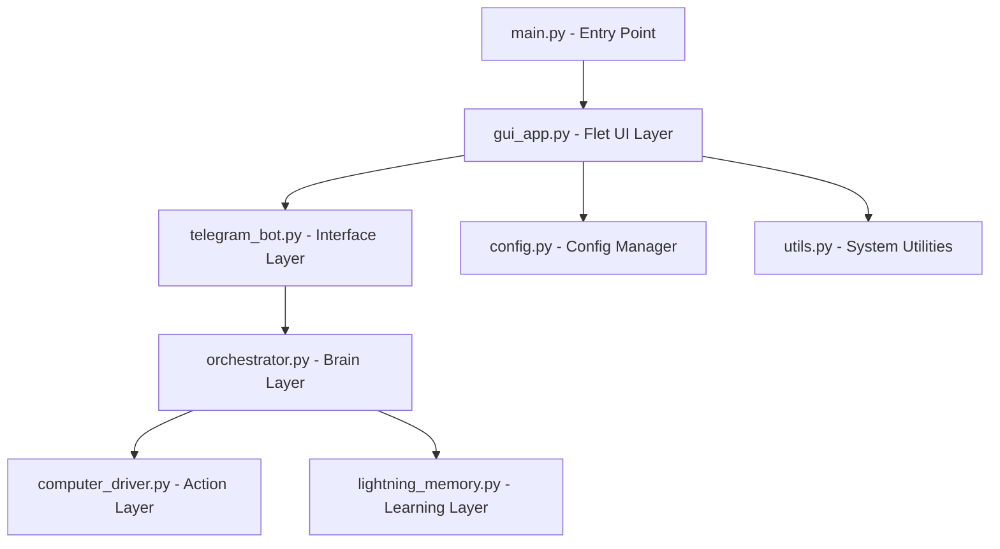

# Panduan Pengembangan Lanjut: DarkSky Desktop

Dokumen ini ditujukan bagi pengembang yang ingin memperluas fitur atau memelihara arsitektur otonom DarkSky.

## Struktur Arsitektur Modular



### 1. GUI Layer (`gui_app.py`)
Menggunakan **Flet** (berbasis Flutter).
- Jika ingin menambah Tab baru, edit list `destinations` pada `NavigationRail` dan tambahkan view di `on_nav_change`.
- State Management sederhana menggunakan atribut class `DarkSkyApp`.
- Threading: Bot Telegram dijalankan di `threading.Thread` agar UI tidak sinkron (blocking). Untuk komunikasi balik dari Bot ke UI, gunakan `logging` yang sudah di-hook oleh `LogHandler`.

### 2. Config & Env (`config.py`)
- Gunakan `save_config(updates: dict)` untuk memperbarui `.env` secara otomatis.
- Setiap variabel baru di `.env` harus didaftarkan di `config.py` agar bisa diakses oleh komponen lain.

### 3. Brain Layer (`orchestrator.py`)
- Ini adalah inti dari "Agentic AI". Logika pembelajaran ada di sini.
- Modifikasi `LightningMemory` di sini jika ingin mengubah cara bot belajar dari kesalahan.

## Cara Build Ulang Aplikasi (.exe)

Gunakan perintah berikut di PowerShell/CMD:
```bash
flet pack main.py --name "DarkSkyAgent"
```
Atau jalankan skrip otomatis: `build_app.bat`.

## Tips Pengembangan
- **Logging**: Selalu gunakan `logging.info()` atau `logging.error()`. Log ini otomatis akan tampil di Dashboard GUI.
- **Auto-Start**: Implementasi saat ini menggunakan Registry Windows. Jika ingin mendukung Linux, tambahkan logika `.desktop` file di `utils.py`.
- **UI Testing**: Jalankan `python main.py` untuk mode pengembangan cepat tanpa harus melakukan build ulang.
